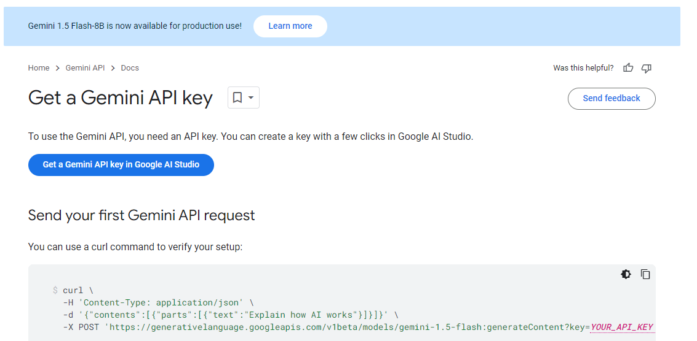

# gemini_llm_app
Repo Created to understand and apply the Google LLM API for our own apps etc.

This is loosely based on a tutorial found [here](https://www.youtube.com/watch?v=vXjOywyMBN8&t=245s)

# Repo Goal
1. Understand how to acquire an API key from Google Gemini 1.5 Flash.
2. Create an app in which to plug the api into.
3. Showcase how the API works within the created app.

# How to acquire an Gemini API Key
1. go to [here](https://ai.google.dev/gemini-api/docs)
2. Click on the "Get a Gemini API key in Google AI Studio" 
3. This will then take you to https://aistudio.google.com/app/apikey and follow the steps to get an api key
    - Make sure to save this key down somewhere, that wont be seen in the application later, such as an environment variable, or similar.
